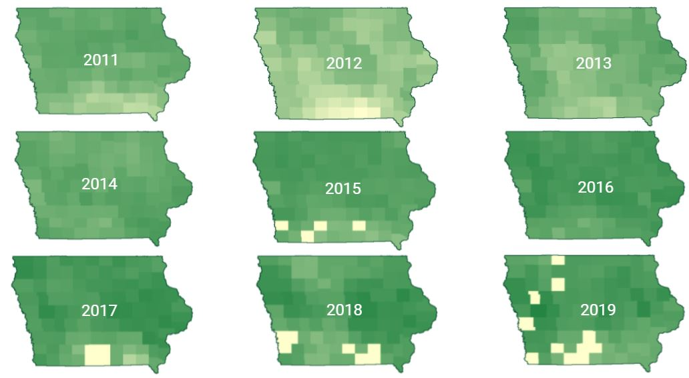
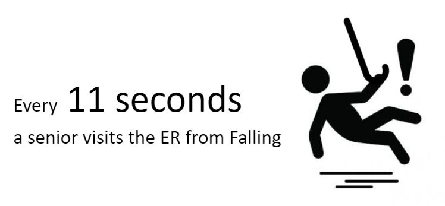
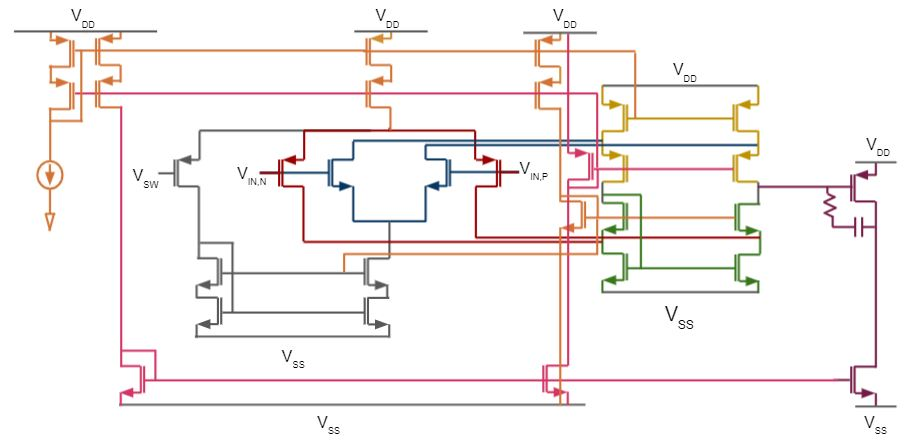
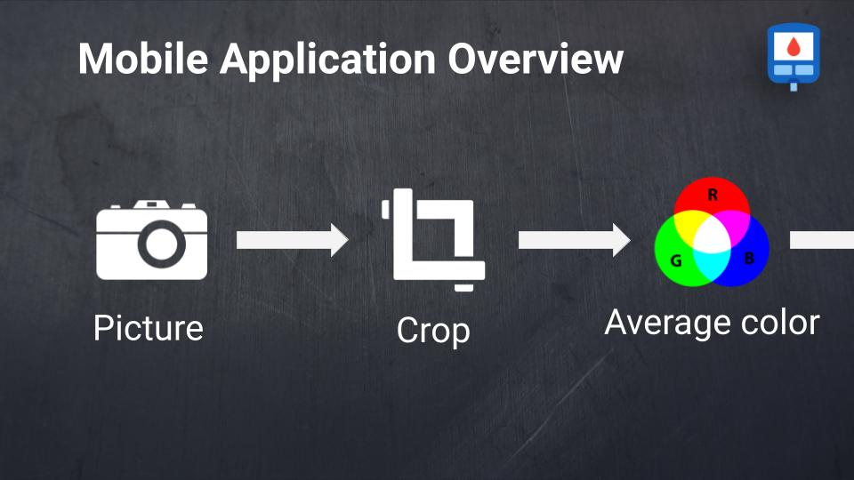
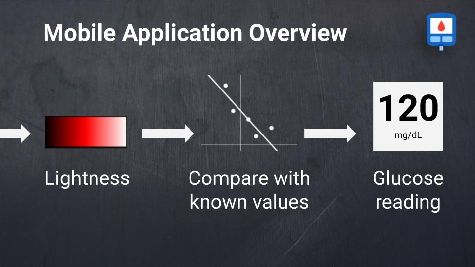

# Visualizations

## Presentations
Here is a list of links to some of my presentations:

* [SPPPACY](https://www.slideshare.net/secret/NsCczeamHp8A9Z) - Spring 2021
* [DanceMuse - Inspiring Art through AI](https://www.slideshare.net/secret/sobQhXC7s1HQQ0) - Spring 2021
* [DefensiveLayer - Defending Against Adversarial Attacks One Layer at a Time](https://www.slideshare.net/secret/KU6C3Q9xmioRiU) - Fall 2020
* [Op Amp for Headphone Amplification](https://docs.google.com/presentation/d/1ajANcjElUjB-Vf8y87AYhKRVyi-I0rwK_Yv31PLvypo/edit?usp=sharing) - Spring 2020
* [LTspice Maximum Power Point Tracker](https://docs.google.com/presentation/d/1iZ_Ebv9KchZnQUemi7ImAyPnkKYEMfxfiKDNNgq_D9w/edit?usp=sharing) - Spring 2020
* [Image Denoising with Two-Dimensional Adaptive Filter Algorithms - Paper Report](https://docs.google.com/presentation/d/11BT5Qidg5nCEQaK__uH1DW5THfEYO4ARP6UZDIA7KxA/edit?usp=sharing) - Summer 2019
* [Low Cost Solutions for Diabetes in Soroti, Uganda](https://docs.google.com/presentation/d/1ZhAfFlsdtEhCnt2fGXxum-f7RSblsnUZWpPdnXfUujw/edit?usp=sharing) - Spring 2018

## Some figures

Taken from SPPPACY project:

  
   
  Visualization of corn yield at each Iowa county from 2011 to 2019. Green indicates high yield while yellow indicates low.

Taken from Remote-Sensing project 2:

  
   
  Mapping the spatial extent of a dataset to undestand distribution and possible causes of model failure. 

Taken from fallback - a system to report accidents in the homes of seniors living alone:

  
   
  Figure to emphasize hazard of falling for seniors

Taken from Op Amp for Headphone Amplification:

  
   
  Op-amp design color-coded by transistor role. Not my best visualization, but it was the culmination of a really long project and I wanted to share. 

Taken from Low Cost Solutions for Diabetes in Soroti, Uganda:

  
  
   
  Overview of proposed application for glucose prediction using colored test strips

